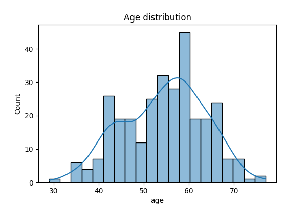
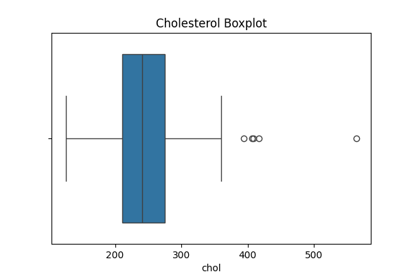
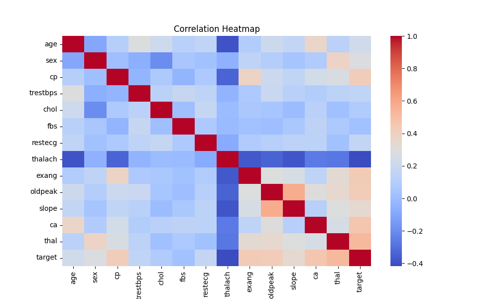
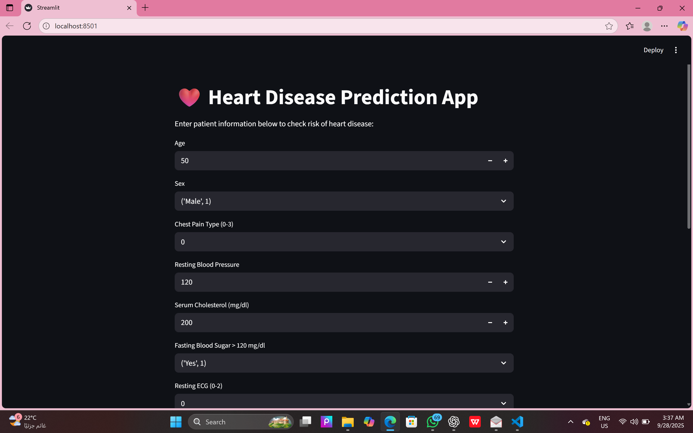

# ❤️ Heart Disease Prediction Project

## 📌 Overview
This project predicts the risk of heart disease using the Cleveland Heart Disease dataset.  
It includes all steps of a full Machine Learning pipeline and an interactive Streamlit app.

### Features:
- Data cleaning & preprocessing  
- PCA analysis  
- Feature selection  
- Supervised learning (Logistic Regression, Decision Tree, Random Forest, SVM)  
- Unsupervised learning (Clustering)  
- Hyperparameter tuning  
- Final app built with **Streamlit**  

---

## 📂 Project Structure
Heart_Disease_Project/
│── data/ # Raw + cleaned datasets
│── models/ # Trained models (final_pipeline.pkl used in app)
│── results/ # Plots & metrics
│── notebooks/ # 6 Jupyter notebooks
│── ui/ # Streamlit app (app.py)
│── README.md # Documentation file

---

## 🚀 How to Run

### 1. Install dependencies

pip install -r requirements.txt

### 2. Run the notebooks

jupyter notebook notebooks/

### 3. Launch the Streamlit app

python -m streamlit run ui/app.py

Then open http://localhost:8501
 in your browser.

✅ Example Prediction

Input: Age = 55, Cholesterol = 250, etc.

Output: ⚠️ Model predicts Heart Disease risk

---

4. Save the file (**CTRL + S**).  
Done ✅  

---

## 📸 Screenshots

### Age Distribution

### Cholesterol Boxplot

### Correlation Heatmap

### Streamlit App

